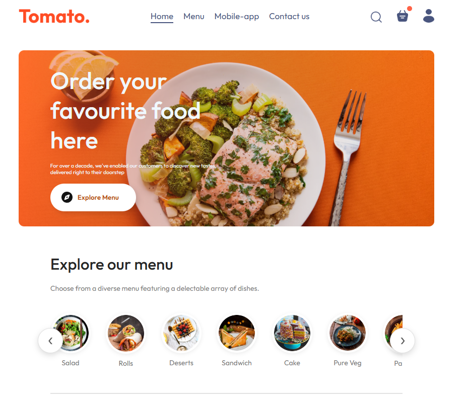
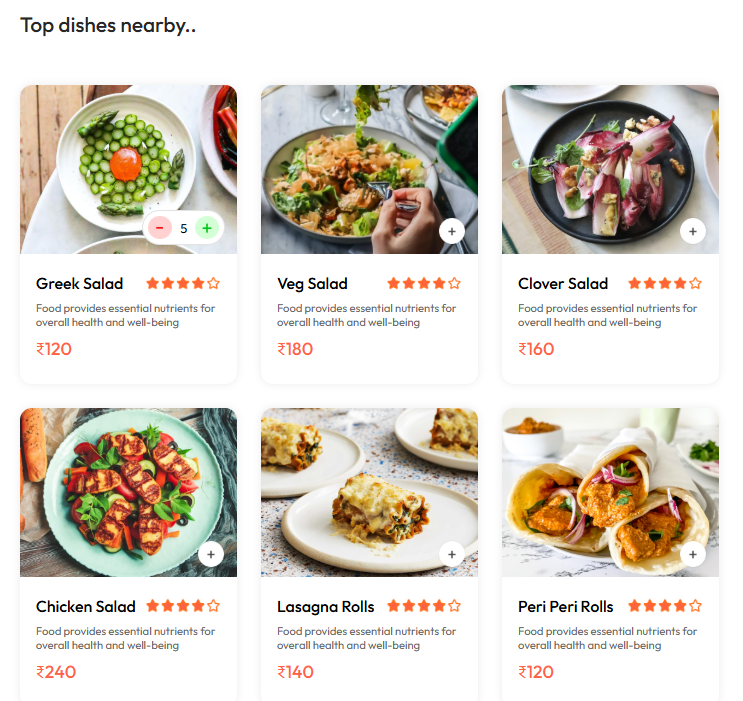
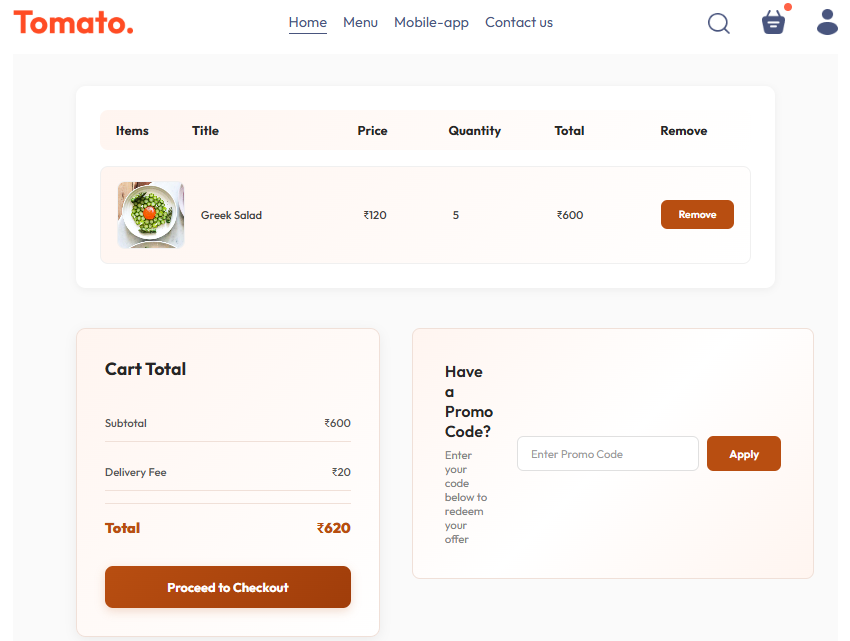
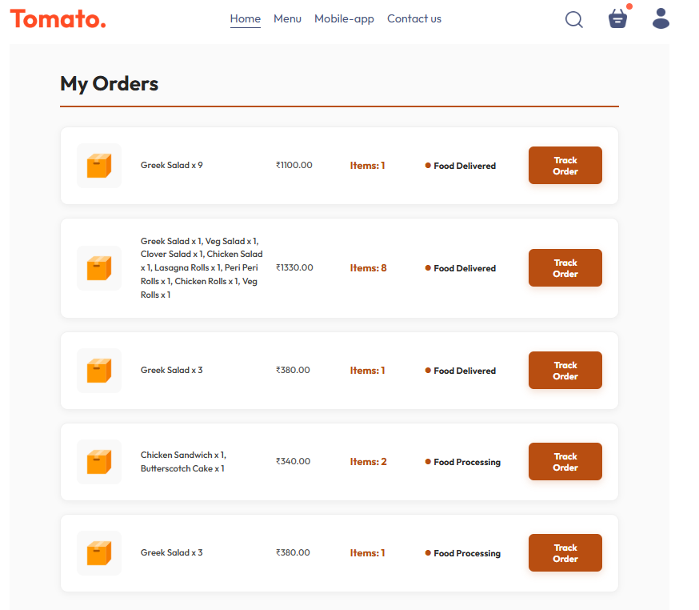
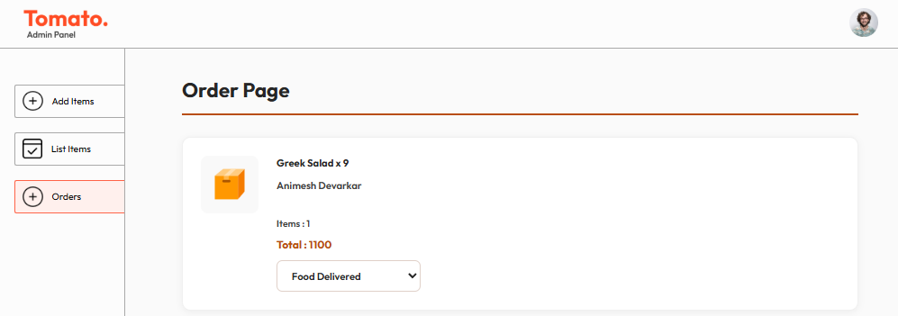
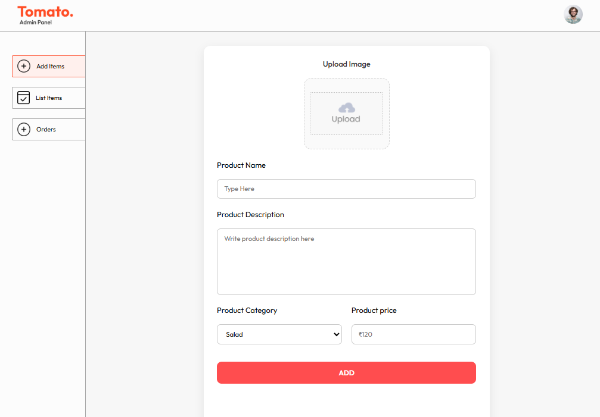
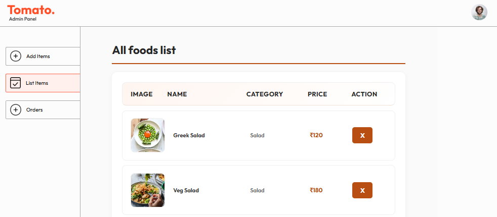

# 🍅 Tomato - Food Delivery App

A full-stack food delivery web application built with the MERN stack. Tomato allows users to browse menus, add items to cart, place orders, and track delivery status — with a complete admin panel for managing food items and orders.

---

## 🚀 Live Demo

🔗 [GitHub Repository](https://github.com/animeshDevarkar/FoodDel-app)

---

## 📸 Screenshots

### 🏠 Home Page


### 🍽️ Food Menu


### 🛒 Cart Page


### 📦 My Orders


### 🛠️ Admin - Add Items


### 📋 Admin - List Items


### 📬 Admin - Orders


---

## ✨ Features

### Customer Side
- 🔐 User authentication (Register / Login) with JWT
- 🍔 Browse food items by category
- 🛒 Add to cart and manage quantities
- 💳 Secure checkout with Stripe payment integration
- 📦 Track order status in real time
- 📱 Responsive design for all devices

### Admin Panel
- ➕ Add new food items with image upload
- 📋 View and manage all food listings
- 📬 View and update order statuses
- 🗑️ Delete food items

---

## 🛠️ Tech Stack

| Layer | Technology |
|-------|-----------|
| Frontend | React.js, Vite, CSS |
| Backend | Node.js, Express.js |
| Database | MongoDB Atlas |
| Authentication | JWT (JSON Web Tokens) |
| Payment | Stripe |
| Image Upload | Multer |
| State Management | React Context API |

---

## 📁 Project Structure

```
food-del/
├── frontend/        # Customer-facing React app
├── admin/           # Admin dashboard (React)
├── backend/         # Node.js + Express REST API
│   ├── config/      # Database connection
│   ├── controllers/ # Route handlers
│   ├── middleware/  # Auth middleware
│   ├── models/      # Mongoose schemas
│   ├── routes/      # API routes
│   └── uploads/     # Uploaded food images
└── screenshots/     # App screenshots
```

---

## ⚙️ Installation & Setup

### Prerequisites
Make sure you have the following installed:
- [Node.js](https://nodejs.org/) (v16 or higher)
- [MongoDB Atlas](https://www.mongodb.com/cloud/atlas) account
- [Stripe](https://stripe.com/) account

---

### 1️⃣ Clone the Repository

```bash
git clone https://github.com/animeshDevarkar/FoodDel-app.git
cd FoodDel-app
```

---

### 2️⃣ Backend Setup

```bash
cd backend
npm install
```

Create a `.env` file in the `backend` folder:

```env
MONGODB_URI=your_mongodb_connection_string
JWT_SECRET=your_jwt_secret_key
STRIPE_SECRET_KEY=your_stripe_secret_key
PORT=4000
```

Start the backend server:

```bash
npm start
```

Backend runs on: `http://localhost:4000`

---

### 3️⃣ Frontend Setup

```bash
cd ../frontend
npm install
npm run dev
```

Frontend runs on: `http://localhost:5173`

---

### 4️⃣ Admin Panel Setup

```bash
cd ../admin
npm install
npm run dev
```

Admin panel runs on: `http://localhost:5174`

---

## 🔑 Environment Variables

| Variable | Description |
|----------|-------------|
| `MONGODB_URI` | MongoDB Atlas connection string |
| `JWT_SECRET` | Secret key for JWT token generation |
| `STRIPE_SECRET_KEY` | Stripe secret key for payments |
| `PORT` | Backend server port (default: 4000) |

---

## 📡 API Endpoints

### Auth
| Method | Endpoint | Description |
|--------|----------|-------------|
| POST | `/api/user/register` | Register a new user |
| POST | `/api/user/login` | Login user |

### Food
| Method | Endpoint | Description |
|--------|----------|-------------|
| GET | `/api/food/list` | Get all food items |
| POST | `/api/food/add` | Add new food item (Admin) |
| DELETE | `/api/food/remove` | Remove food item (Admin) |

### Cart
| Method | Endpoint | Description |
|--------|----------|-------------|
| POST | `/api/cart/add` | Add item to cart |
| POST | `/api/cart/remove` | Remove item from cart |
| POST | `/api/cart/get` | Get user cart |

### Orders
| Method | Endpoint | Description |
|--------|----------|-------------|
| POST | `/api/order/place` | Place an order |
| POST | `/api/order/verify` | Verify payment |
| GET | `/api/order/userorders` | Get user orders |
| GET | `/api/order/list` | Get all orders (Admin) |
| POST | `/api/order/status` | Update order status (Admin) |

---

## 🤝 Contributing

Contributions are welcome! Feel free to open an issue or submit a pull request.

1. Fork the project
2. Create your feature branch (`git checkout -b feature/AmazingFeature`)
3. Commit your changes (`git commit -m 'Add some AmazingFeature'`)
4. Push to the branch (`git push origin feature/AmazingFeature`)
5. Open a Pull Request

---


## 👨‍💻 Author

**Animesh Devarkar**
- GitHub: [@animeshDevarkar](https://github.com/animeshDevarkar)

---

⭐ If you found this project helpful, please give it a star!


Credits - GreatStack